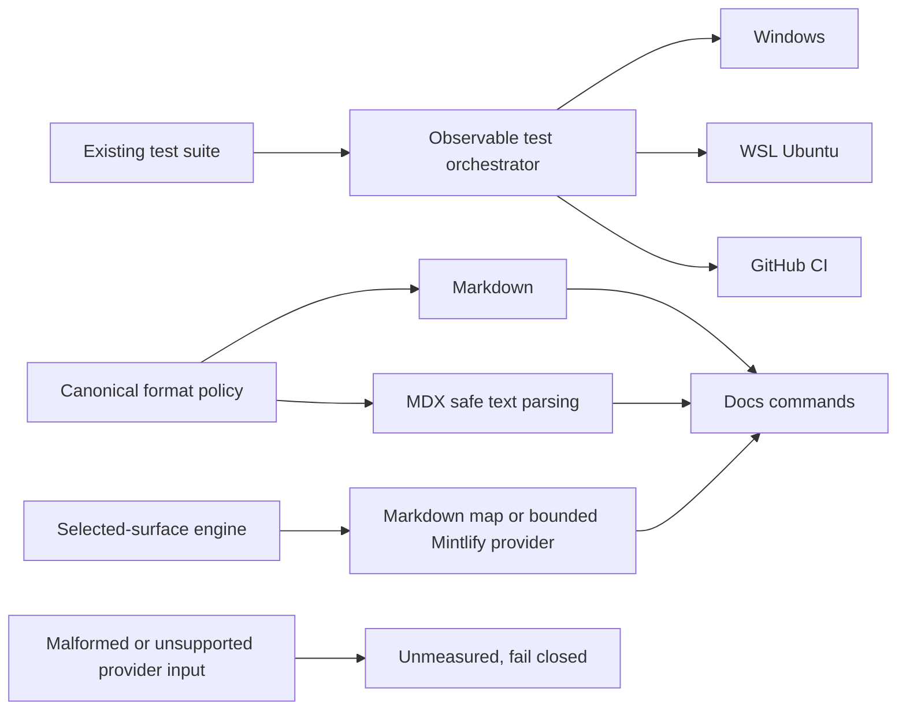

# Testing

The repository uses the Python standard library's `unittest` framework. One observable orchestrator partitions the existing modules into meaningful groups, runs the same commands on Windows, WSL Ubuntu, and GitHub Actions, prints live progress and elapsed time, and fails when the partition does not cover every `tests/test_*.py` module exactly once.



## Commands

Run the narrowest relevant group first:

```text
python -B tools/run_tests.py core
python -B tools/run_tests.py lifecycle
python -B tools/run_tests.py trajectory
```

Run every group before completion:

```text
python -B tools/run_tests.py all
```

Inspect or verify the partition without executing tests:

```text
python -B tools/run_tests.py list
python -B tools/run_tests.py verify
```

The orchestrator prints each group start and finish, module/test progress from verbose `unittest`, elapsed time, and a heartbeat every 30 seconds while work is still running. `--heartbeat-seconds` changes that interval and `--failfast` stops at the first failure.

## WSL performance

Run the Ubuntu proof from a Linux-native checkout under `$HOME`, not directly from `/mnt/c`, `/mnt/d`, or another Windows-mounted path. The Windows bridge is correct but makes metadata-heavy lifecycle tests much slower; the backing WSL virtual disk can still live on the chosen Windows drive. Keep the Windows checkout authoritative, copy or clone it into a clearly named disposable Linux directory for verification, and remove only that verified copy afterward.

## Proof order

1. Add or run the smallest regression that proves the changed behavior.
2. Run its owning group on Windows.
3. Run the same group in WSL Ubuntu.
4. Regenerate and verify generated adapters when canonical skill content changed.
5. Run the repository documentation checker.
6. Run `all` on Windows and WSL once the narrower gates pass.
7. Let CI repeat the same grouped commands; CI confirms local evidence rather than discovering basic failures.

Provider regressions also prove that Map, Check, Doctor, Audit, and Init use the same selected-surface evidence, while semantic candidates remain labeled and bounded.

No valid test may be skipped, deleted, or weakened to pass a gate. A completion claim requires fresh output, a reviewed diff, and explicit separation of change-caused failures from verified pre-existing failures.
